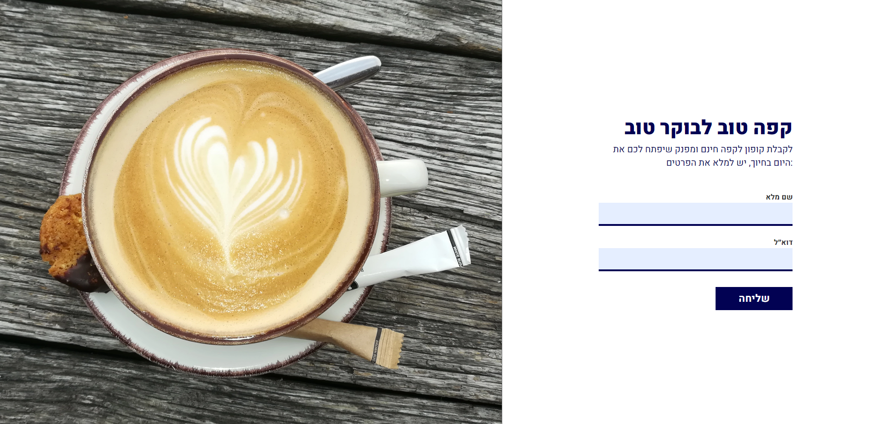

# Good Coffee for a Good Day

A pixel-perfect HTML & CSS implementation of a coffee-themed promotional landing page Figma UI design.



---

## Table of Contents

- [Overview](#overview)
- [Demo](#demo)
- [Tech Stack](#tech-stack)
- [Project Structure](#project-structure)
- [Getting Started](#getting-started)
- [Design Reference](#design-reference)
- [Responsive Design](#responsive-design)
- [License](#license)

---

## Overview

This project is a UI implementation exercise built from a Figma design. It showcases a warm, inviting single-page layout for a coffee brand, featuring hero imagery, custom typography, and clean CSS styling.

---

## Demo

Open `index.html` directly in your browser — no build step or server required.

---

## Tech Stack

| Technology | Purpose |
|---|---|
| HTML5 | Semantic page structure |
| CSS3 | Layout, styling, and visual design |
| Google Fonts | Custom web font (Heebo) |

---

## Project Structure

```
good-coffee-for-a-good-day/
├── index.html                          # Main HTML file
├── good_coffee_for_good_morning.css    # All styles
└── images/                             # Product and preview images
    ├── project_preview.png
    ├── Coffee.png
    └── 2x_Coffee.png                   # Retina-ready version
```

---

## Getting Started

1. Clone or download the repository.
2. Open `index.html` in any modern browser.

No dependencies to install. No build tools needed.

---

## Design Reference

This project was implemented based on a Figma design. Key design elements include:

- Full-width hero section with product imagery
- Retina-ready images (`2x` variants included)
- Custom Google Font (Heebo) for clean, modern typography
- Brand-consistent color palette and spacing

---

## Responsive Design

The layout uses flexible CSS units and media queries to ensure the page looks great across desktop and mobile screen sizes.

---

## License

This project is intended for educational and portfolio purposes.
